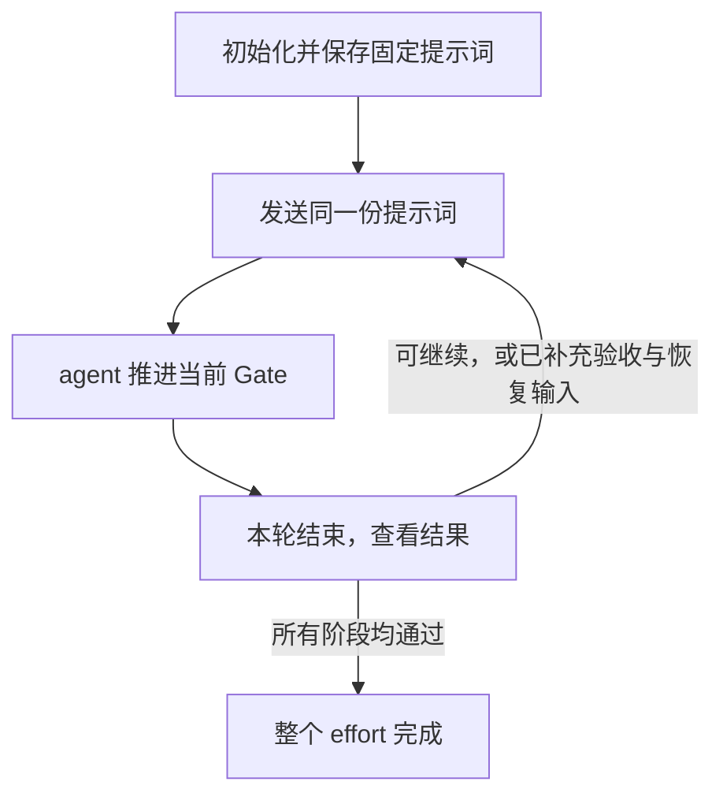

# Goal Loop

Goal Loop 把已经确定的需求和决策拆成可验收的执行计划，并生成一份可以反复使用的固定提示词。你初始化一次，保存提示词，之后每轮复制同一段文本启动任务，直到整个工作完成。

agent 会读取最新进度、选择当前工作、实现、验证和保存记录。你无需选择 Gate、查询 Revision、运行控制命令或获取下一轮提示词。

## 适用场景与准备

适合已有明确目标、需要分阶段执行或跨多轮接续的工作。输入可以是 effort 目录（这一项工作的文档目录）、已收敛的 map、已接受的 ADR、spec，或现有 implementation plan。影响当前范围与验收的决策应已确定；缺少的必要决策会由 agent 指出。

执行环境需要能访问目标 Git 仓库、skill 目录和 Python 3.11+。控制脚本只依赖 Python 标准库；项目自身的构建、测试和验收环境按项目要求准备。

## 第一次使用

在目标仓库中向 agent 提供实际文档路径，例如：

```text
使用 $goal-loop，根据 docs/efforts/reader/spec.md 中已确定的需求，
在 docs/efforts/reader 中生成执行计划、运行记录和固定提示词。
请完整输出可复制的提示词，供我后续反复启动任务。
本次先完成初始化。
```

agent 会审查输入，将任务拆成具有明确范围与验收条件的 Gate，初始化进度，并交付：

| 工件 | 用途 |
| --- | --- |
| `implementation-plan.md` | 做什么、按什么顺序、如何切片和证明完成 |
| `goal/runbook.md` | 查看当前进度、恢复点和检查状态 |
| `goal/prompt.md` | 可直接复制发送的固定提示词正文 |
| `goal/history/`、`goal/commits/`、`goal/objects/` | 供 agent 追溯与恢复的记录和证据 |

初始化回复会直接给出完整的提示词代码块。保存这段文本即可，也可以从 `goal/prompt.md` 复制；其中的实际路径已经填好。上面的示例用于初始化，后续执行使用 agent 交付的固定正文。

## 每轮如何继续

1. 复制并发送已保存的固定提示词，启动一个 Goal；新会话也要能访问同一个仓库与 effort。
2. agent 读取最新进度，在当前 Gate 内持续实现、验证和记录。
3. 本轮结束后查看结果；可以继续时，再次发送原来的同一段提示词。
4. agent 报告整个 effort 完成后，循环结束。



Gate 是计划中一个有明确目标和验收条件的阶段；Goal 是你发送提示词启动的一次任务；slice 是 agent 在阶段内部选择的一小块可验证工作。一个 Goal 可以连续完成多个 slice。Gate 通过后本轮结束，下一轮自动接续直接后继；同一个 Gate 也可能因交接或中断跨越多轮。

## 验收、恢复与完成

| agent 报告的情况 | 你需要做什么 |
| --- | --- |
| 当前 Gate 通过，还有后续阶段 | 再次发送原固定提示词 |
| 已保存 checkpoint，当前阶段尚未完成 | 再次发送原提示词，agent 从保存点继续 |
| 会话意外中断 | 在同一工作区发送原提示词，agent 检查记录并恢复；已有检查仍在运行时会说明情况 |
| 需要人工验收 | 按给出的入口和最小清单检查，再发送原提示词并附上明确结果 |
| 依赖不可用或存在必要决策缺口 | 按报告补充输入或恢复条件，再发送原提示词 |
| 整个 effort 完成 | 无需继续；误发原提示词时，agent 会确认完成状态 |

人工验收结果附在固定正文之后即可，例如：

```text
验收 A000003：未通过。构建 reader-42 的读取页面中，空值展示正确，
但接口失败时错误详情没有显示。
```

使用 agent 实际给出的验收编号、对象和回复格式。验收期间本轮已经结束；未提供明确结果而只重复发送提示词时，agent 会提醒待验事项。失败结果用于修复，过期对象的结果不能代替当前对象的验收。

## 常见问题

**需要修改提示词里的 Gate、进度或编号吗？**

不需要。固定正文指示 agent 自行读取最新状态；验收结果或必要的新输入作为附加内容提供。

**每轮都要重新调用 `$goal-loop` 吗？**

正常接续只需发送已有固定正文。需求变化需要修订计划，或需要专项诊断与恢复时，可以再调用 skill 并说明问题。

**需要自己运行 Python 或控制脚本吗？**

命令由 agent 执行。用户负责启动任务、提供确实缺少的决策或环境，以及计划要求的人工验收。

**提示词文件丢了，保存的文本还能用吗？**

可以。`goal/prompt.md` 只是复制便利文件，计划和 runbook 不依赖它。agent 可以恢复原文；请保留运行记录与证据目录。

**更新 skill 会改变已有任务的提示词吗？**

不会。已有 effort 保留初始化时的固定正文和执行记录，新模板用于新建 effort。恢复操作重建原文，无需升级或重新初始化。

## 内部机制与维护

- [Skill 入口与维护验证](SKILL.md)
- [计划拆分与合同字段](references/implementation-plan-schema.md)
- [固定提示词模板](references/goal-prompt-template.md)
- [控制命令](references/control-script.md)
- [存储与恢复](references/storage-and-recovery.md)
- [合同修订](references/contract-revisions.md)
- [执行术语](references/glossary.md)
